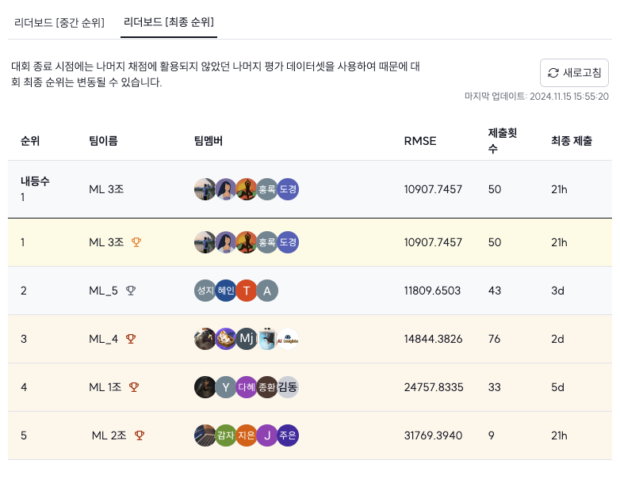

# 아파트 실거래가 예측 대회 (Team Avengers)
## 팀원소개

|  |  |  |  |  |
| :--------------------------------------------------------------: | :--------------------------------------------------------------: | :--------------------------------------------------------------: | :--------------------------------------------------------------: | :--------------------------------------------------------------: |
|            [김예승](https://github.com/yes-yeseung)             |           [김도경](https://github.com/kimdogyeong)              |          [김지식](https://github.com/danver0921)               |            [이홍록](https://github.com/efforter)             |            [은지영](https://github.com/JJy99)             |
|팀장|팀원|팀원|팀원|팀원|

- 대부분의 작업을 모두가 함께 했습니다.

## 대회 정보

아파트 실거래가를 예측하는 Regression 대회로 [AI Stages](https://stages.ai/)에서 진행

- 목표: 서울시 아파트 실거래가 데이터를 활용해서 평가 데이터의 실거래가 예측
- 대회 진행 기간 : 2024년 11월 4일 ~ 14일
- 평가 지표 : RMSE
- 외부 데이터의 사용이 가능
- Upstage에서 3090 GPU 서버가 제공됨

## 데일리 일정
- 매일 오전 10시 데일리 스크림을 통해 진행상황을 공유
- 매일 오후 4시 그룹 스터디를 통해 각자의 결과물을 서로 공유
- 대회 시작 이전에 Boston House Prices 데이터셋을 사전학습

## 진행
- 결측치 복구. 제공 받은 데이터에서 아파트 단지 정보의 77%가 누락되어 있어서 공공데이터포털에서 데이터를 복구함. 결측치 비율을 19%로 낮춤
  - 사용한 API 
    - [국토교통부_공동주택 단지 목록제공 서비스](https://www.data.go.kr/data/15057332/openapi.do)
    - [국토교통부_공동주택 기본 정보제공 서비스](https://www.data.go.kr/data/15058453/openapi.do)

- 경위도가 대부분 누락되어 있어서 주소를 이용해서 결측치를 모두 채웠다.
- LightGBM과 XGBoost를 앙상블해서 점수를 높였다.
- 시군구별로 특성이 다른 곳이 눈에 띄었다. 구별로 RMSE를 기준으로 5개의 그룹으로 나눠 따로 훈련하고 예측했다.

## 결과

#### 리더보드 점수

    
    
Public 리더보드

    
    
Private 리더보드

#### 발표 자료 
[다운로드](./docs/발표자료.pdf)
